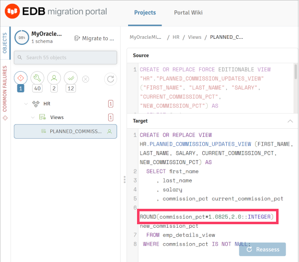

# Oracle Migration Demo

## Demo prep

Create an EDB repo token and store this token in `$HOME/.edbtoken`

[Create a free account with Oracle](https://profile.oracle.com/myprofile/account/create-account.jspx).

Run script `00-provision.sh`. This script will:
- Create a Big Animal instance according to `ba-config.yaml`
- Create containers for the EDB tools and Oracle database
- Load database schemas into Oracle database
- Setup PEM
- Setup the Migration toolkit
- Setup LiveCompare

The script will finish showing you access details similar to this:
```
--- Info ---
EDB IP Address: 172.17.0.3
EDB PEM URL: https://172.17.0.3/pem
Oracle Database Password: f19ee331c43e327a
Oracle Database IP Address: 172.17.0.2
┌────────────────────────────────────────────────────────────────────────────────────────────────────────────────────────────────────────────────────────────────────────────┐
│ Clusters                                                                                                                                                                   │
├──────────────┬────────────────────────┬──────────┬──────────────┬─────────┬───────────┬───────────────┬──────────────────────────────────┬────────────────────┬────────────┤
│ ID           │ Name                   │ Provider │ Architecture │ Status  │ Region    │ Instance Type │ Postgres Details                 │ Maintenance Window │ FAReplicas │
├──────────────┼────────────────────────┼──────────┼──────────────┼─────────┼───────────┼───────────────┼──────────────────────────────────┼────────────────────┼────────────┤
│ p-78sv9i7qnb │ tons-biganimal-cluster │ AWS      │ single       │ Healthy │ EU West 1 │ m5.large      │ EDB Postgres Advanced Server v15 │ Disabled           │ N/A        │
│              │                        │          │              │         │           │               │                                  │                    │            │
└──────────────┴────────────────────────┴──────────┴──────────────┴─────────┴───────────┴───────────────┴──────────────────────────────────┴────────────────────┴────────────┘
┌───────────────────────┬──────────────────────────────────────────────────────────────────────────────────────────┐
│ Name                  │ Details                                                                                  │
├───────────────────────┼──────────────────────────────────────────────────────────────────────────────────────────┤
│ read-write-connection │ postgresql://edb_admin@p-78sv9i7qnb.private.8iufxybhqsx2cu1t.biganimal.io:5432/edb_admin │
│ rw-service-name       │ N/A                                                                                      │
│ read-only-connection  │ Not Supported                                                                            │
│ ro-service-name       │ Not Supported                                                                            │
└───────────────────────┴──────────────────────────────────────────────────────────────────────────────────────────┘
```

# Demo Flow
1. Log into the EDB [Migration Portal](https://migration.enterprisedb.com).
2. Download the EDB DDL Extractor.
3. Copy the DDL Extractor to the `docker/` subdirectory, which is mounted at
   `/mnt` within the **edbdemo** container.
4. Run the EDB DDL Extractor using the provided help script:
   `docker/extract-ddl`
   1. Press `RETURN` at the first prompt to continue:  
      `Press RETURN to continue ...`  
   2. Enter `HRPLUS` to only extract the `HRPLUS` database (multiple databases are
      installed:  
      `Enter a comma-separated list of schemas, max up to 240 characters
      (Default all schemas): HRPLUS`  
   3. Enter `/mnt/` (trailing slash is required) and press `RETURN` at next
	  prompt so that the resulting DDL file will in the `docker/` directory:  
      `Location for output file (Default current location) : `  
   4. Enter `yes` at next prompt to extract any objects from other schemas:  
      `Extract dependent object from other schemas?(yes/no) (Default no /
      Ignored for all schemas option):yes`  
 ```
# -- EDB DDL Extractor Version 2.3.8 for Oracle Database -- #
# --------------------------------------------------------- #

Caution:
Script USER must have CONNECT and SELECT_CATALOG_ROLE roles and CREATE TABLE privilege.
(To verify granted roles and privileges, run the following commands: SELECT granted_role FROM user_role_privs;  or  SELECT privilege FROM user_sys_privs;)

Press RETURN to continue ...

Enter a comma-separated list of schemas, max up to 240 characters (Default all schemas): HRPLUS
Location for output file (Default current location) : /mnt/

WARNING:
Given schema(s) list may contain objects which are dependent on objects from other schema(s), not mentioned in the list.
Assessment may fail for such objects. It is suggested to extract all dependent objects together.

Extract dependent object from other schemas?(yes/no) (Default no / Ignored for all schemas option):yes

Extract GRANT statements?(yes/no) (Default no):yes

```
5. Note the name of the resulting DDL file.  Near the end of the DDL Extractor
   out will be a message with the filename: We have stored DDL(s) for
   Schema(s)  HRPLUS to ***_gen_hrplus_ddls_211111213244.sql***.
6. Back in the Migration Portal, create a new project
   1. Enter a new project name.
   2. The Oracle version used in this kit is 18c.
   3. The Postgres version is ***13***. Choosing a later version reduces the number of errors.
   3. The DDL file to choose is the one just created from the container:
      `_gen_hrplus_ddls_211111213244.sql`
   4. Click **Create & assess**.  
7. Demonstrate how to correct the reported errors.
   1. Click the right error to expand the schema details.  
   2. Expand the HRPLUS schema in the left sidebar and filter for failures by
	  clicking on the exclamation point within the diamond.  
   5. Fix the *PLANNED_COMMISSION_UPDATES_VIEW* view.
      1. Cast the second argument of the `ROUND()` function to an integer.  
      
8. Migrate the schema to BigAnimal.
   1. Click on `Migrate to ...`  
   2. Select `Online Migration`
   3. The `HRPLUS` should be selected, and the only schema listed.  Click `Next`.  
   4. Enter the connection information to BigAnimal, click `Test Connection`,
      then click `Next`.
      1. Target Database: `edb_admin`
      2. Host Name/Address: `p-78sv9i7qnb.private.8iufxybhqsx2cu1t.biganimal.io`
      3. Password: `enterprisedb` 
   5. When migration is complete, you may click `Done`.  

## Migration Tool Kit

Run MTK to migrate the data from the Oracle database to BigAnimal: `docker/mtk-migration`  
```
******************** Migration Summary ********************
Tables: 8 out of 8

Total objects: 8
Successful count: 8
Failed count: 0
Invalid count: 0

*************************************************************
```

## LiveCompare

1. Edit the sample `docker/my_project.ini` file in the repository with correct
   hostnames and password for BigAnimal and IP address for the Oracle
   container.
2. Run LiveCompare with the helper script: `docker/compare`  
```
LiveCompare session 10, compare mode, finished with some appointments:
    warnings: 4
    errors: 0
    critical errors: 0
You can have more details in the log file(s): ./lc_session_10/lc_compare_*.log

Saved file ./lc_session_10/summary_20211210.out with the complete table summary.
You can also get the table summary by connecting to the output database and executing:
select * from livecompare.vw_table_summary where session_id = 10;

Elapsed time: 0:00:10.129037
Processed 215 rows in 8 tables from 2 connections using 4 workers.
Found 0 inconsistent rows.

Copyright EnterpriseDB UK Limited 2019-2021 - All rights reserved.
```
3. Review the summary, note that the file is relative to the `docker`
   directory: `cat docker/lc_session_10/summary_20211210.out`  
```
+--------------------+----------------+------------------+----------------------+-------------------+---------------------------+
| table_name         | elapsed_time   |   num_total_rows |   num_processed_rows |   num_differences |   max_num_ignored_columns |
|--------------------+----------------+------------------+----------------------+-------------------+---------------------------|
| hrplus.countries   | 0:00:00.094966 |               25 |                   25 |                 0 |                         0 |
| hrplus.departments | 0:00:00.092961 |               27 |                   27 |                 0 |                         0 |
| hrplus.emp_audit   | 0:00:00.092372 |                0 |                    0 |                 0 |                         0 |
| hrplus.employees   | 0:00:00.154021 |              107 |                  107 |                 0 |                         0 |
| hrplus.job_history | 0:00:00.130495 |               10 |                   10 |                 0 |                         0 |
| hrplus.jobs        | 0:00:00.127978 |               19 |                   19 |                 0 |                         0 |
| hrplus.locations   | 0:00:00.121004 |               23 |                   23 |                 0 |                         0 |
| hrplus.regions     | 0:00:00.131928 |                4 |                    4 |                 0 |                         0 |
+--------------------+----------------+------------------+----------------------+-------------------+---------------------------+
```


## Quick Notes

### Starting Docker Containers

The installation scripts only need to be run once.  If you reboot your laptop,
you may need to restart the Docker containers:

* `docker start orademo`
* `docker start edbdemo`
* `docker/start-pem` - The **edbdemo** container needs to be started first,
  then this script starts **httpd** and PostgreSQL processes.

### Connect to Oracle Database

Once the containers have been created and are running, you can connect to
Oracle as *sysdba* by running the following helper script: `docker/connect`

```
% docker/connect
executing: sqlplus sys/c90c1b7f2eb71d9c@XEPDB1 as sysdba

SQL*Plus: Release 18.0.0.0.0 - Production on Wed Dec 8 18:04:28 2021
Version 18.4.0.0.0

Copyright (c) 1982, 2018, Oracle.  All rights reserved.


Connected to:
Oracle Database 18c Express Edition Release 18.0.0.0.0 - Production
Version 18.4.0.0.0

SQL>
```

### Container information

Run the following script to get a summary of each container's IP address,
automatically generated Oracle database passwords, and other helpful URLs:
`docker/info`

```
% docker/info
EDB IP Address: 172.17.0.3
EDB PEM URL: https://172.17.0.3/pem
Oracle Database Password: c90c1b7f2eb71d9c
Oracle Database IP Address: 172.17.0.2
```

