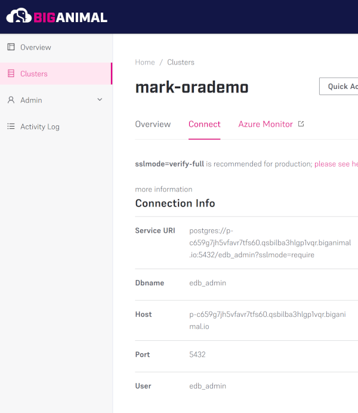
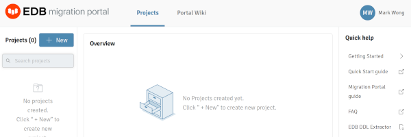
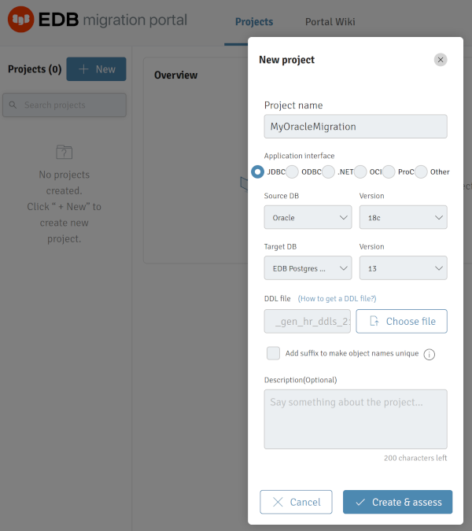
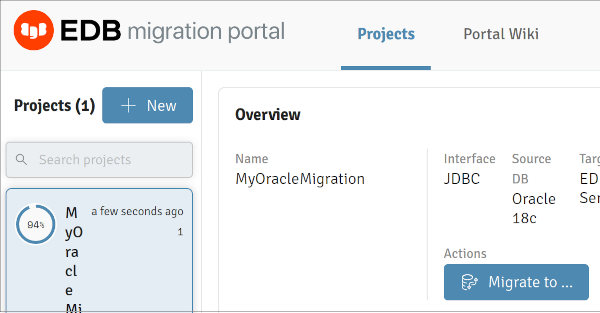
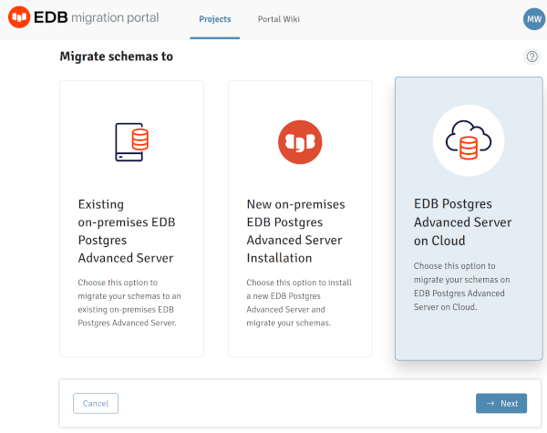
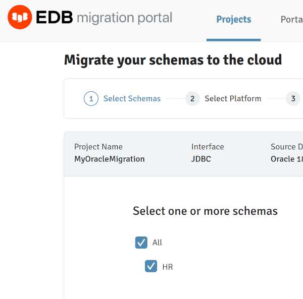
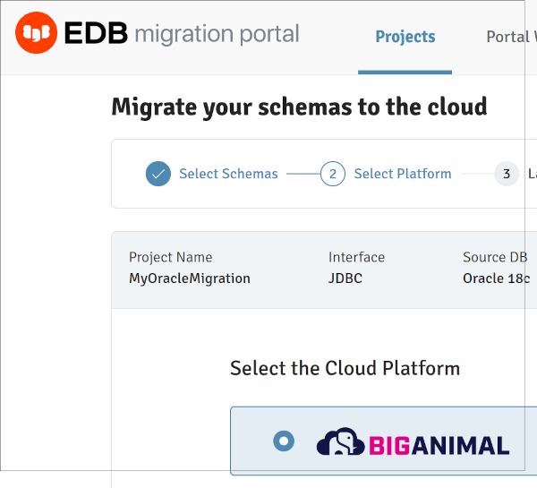
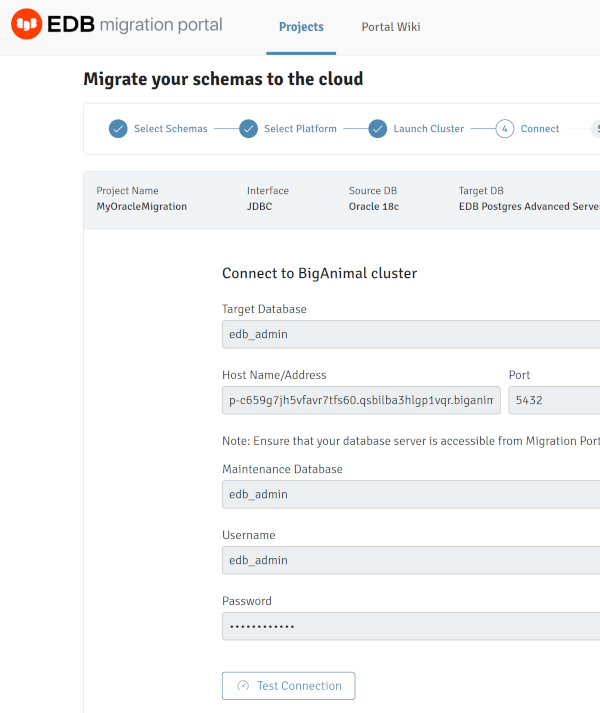
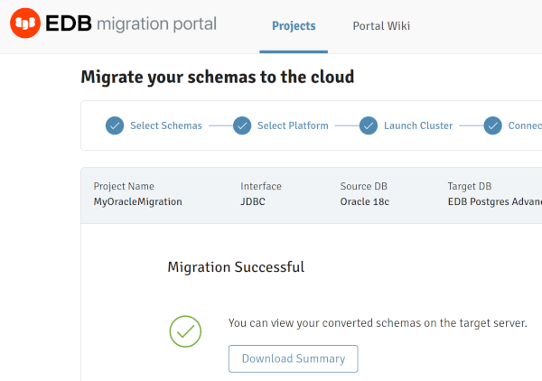

# Demo Guide

This is a recommended guide on how to perform a demonstrator of an Oracle
database migration using the EDB migration tools.

## EDB Migration Portal

The EDB Migration Portal is used to analyze the Oracle schema and generate a
compatible PostgreSQL Schema.

### Preparation

Passwords, IP addresses and connection information should be gathered from the
the BigAnimal cluster before performing the demo, unless you wish to demo that
aspect of BigAnimal.

The IP address and Oracle sysdba password can be retrieved by running:
`docker/info`

```
% docker/info
EDB IP Address: 172.17.0.3
EDB PEM URL: https://172.17.0.3/pem
Oracle Database Password: c90c1b7f2eb71d9c
Oracle Database IP Address: 172.17.0.2
```

The connection information from the BigAnimal clusters:

1. Click on `Clusters` in the left sidebar.
2. Click on the lock shaped icon next to the cluster to use.
3. Note the `Dbname`, `Host`, and `User` information.  The password will be
   what was entered when creating the cluster.



### Demonstration

1. Log into the EDB [Migration Portal](https://migration.enterprisedb.com).
2. Download the EDB DDL Extractor.  A direct link to the DDL Extractor cannot
   be provided at this time.  
   
3. Copy the DDL Extractor to the `docker/` subdirectory, which is mounted at
   `/mnt` within the **edbdemo** container.
4. Run the EDB DDL Extractor using the provided help script:
   `docker/extract-ddl`
   1. Press `RETURN` at the first prompt to continue:  
      `Press RETURN to continue ...`  
   2. Enter `HR` to only extract the `HR` database (multiple databases are
      installed:  
      `Enter a comma-separated list of schemas, max up to 240 characters
      (Default all schemas): HR`  
   3. Enter `/mnt/` (trailing slash is required) and press `RETURN` at next
	  prompt so that the resulting DDL file will in the `docker/` directory:  
      `Location for output file (Default current location) : `  
   4. Enter `yes` at next prompt to extract any objects from other schemas:  
      `Extract dependent object from other schemas?(yes/no) (Default no /
      Ignored for all schemas option):yes`  
 ```
# -- EDB DDL Extractor Version 2.3.8 for Oracle Database -- #
# --------------------------------------------------------- #

Caution:
Script USER must have CONNECT and SELECT_CATALOG_ROLE roles and CREATE TABLE privilege.
(To verify granted roles and privileges, run the following commands: SELECT granted_role FROM user_role_privs;  or  SELECT privilege FROM user_sys_privs;)

Press RETURN to continue ...

Enter a comma-separated list of schemas, max up to 240 characters (Default all schemas): HR
Location for output file (Default current location) : /mnt/

WARNING:
Given schema(s) list may contain objects which are dependent on objects from other schema(s), not mentioned in the list.
Assessment may fail for such objects. It is suggested to extract all dependent objects together.

Extract dependent object from other schemas?(yes/no) (Default no / Ignored for all schemas option):yes

```
5. Note the name of the resulting DDL file.  Near the end of the DDL Extractor
   out will be a message with the filename: `We have stored DDL(s) for
   Schema(s)  HR to _gen_hr_ddls_211111213244.sql.`
6. Back in the Migration Portal, create a new project
   1. Enter a new project name.
   2. The Oracle version used in this kit is 18c.
   3. The DDL file to choose is the one just created from the container:
      `_gen_hr_ddls_211111213244.sql`
   4. Click **Create & assess**.  
      
7. Demonstrate how to correct the reported errors.
   1. TBD
8. Migrate the schema to BigAnimal.
   1. Click on `Migrate to ...`  
      
   2. Select `EDB Postgres Advanced Server on Cloud` and click `Next`.  
      
   3. The `HR` should be selected, and the only schema listed.  Click `Next`.  
      
   4. Select `BigAnimal` and click `Next`.  
      
   5. If a BigAnimal cluster doesn't exist yet, create one now.  Then click
      `Next`.
   6. Enter the connection information to BigAnimal, click `Test Connection`,
      then click `Next`.
      1. Target Database: edb_admin
      2. Host Name/Address: copied from above
      3. Password: password that was entered when creating BigAnimal cluster  
      
   7. When migration is complete, you may click `Done`.  
      

## Migration Took Kit

The previously used IP Address and the Oracle user password of the Oracle
docker instance is to be reused here, as well as the connection information for
the BigAnimal cluster that was previously created.

1. Edit the MTK properties file with by running the follow script (the script
   opens the properties file in an editor on the virtual machine):
   `docker/config-mtk`
   1. Update `SRC_DB_URL`: jdbc:oracle:thin:@//172.17.0.2:1521/XEPDB1
   2. Update `SRC_DB_USER`: system
   3. Update `SRC_DB_PASSWORD`: c90c1b7f2eb71d9c
   4. Update `TARGET_DB_URL`: jdbc:edb://p-c659g7jh5vfavr7tfs60.qsbilba3hlgp1vqr.biganimal.io:5432/edb_admin
   5. Update `TARGET_DB_USER`: edb_admin
   6. Update `TARGET_DB_PASSWORD`: <password used when creating BigAnimal
      cluster>
```
SRC_DB_URL=jdbc:oracle:thin:@//172.17.0.2:1521/XEPDB1
SRC_DB_USER=system
SRC_DB_PASSWORD=c90c1b7f2eb71d9c

TARGET_DB_URL=jdbc:edb://p-c659g7jh5vfavr7tfs60.qsbilba3hlgp1vqr.biganimal.io:5432/edb_admin
TARGET_DB_USER=edb_admin
TARGET_DB_PASSWORD=<password used when creating BigAnimal cluster>
```
3. Run MTK to migrate the data from the Oracle database to BigAnimal:
   `docker/mtk-migration`  
```
******************** Migration Summary ********************
Tables: 8 out of 8

Total objects: 8
Successful count: 8
Failed count: 0
Invalid count: 0

*************************************************************
```

## LiveCompare

1. Edit the sample `docker/my_project.ini` file in the repository with correct
   hostnames and password for BigAnimal and IP address for the Oracle
   container.
2. Run LiveCompare with the helper script: `docker/compare`
